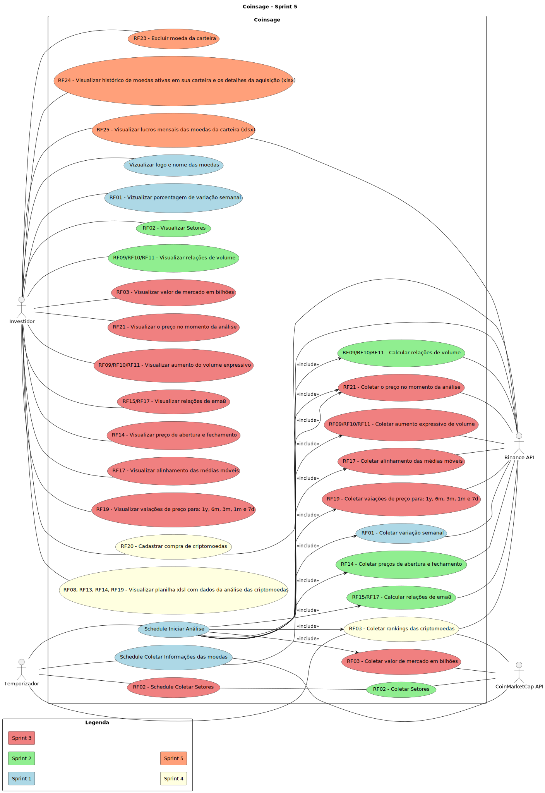

# Diagramas de Caso de Uso

# Descrição dos Casos de Uso

[RF20 - Cadastrar compra de criptomoedas](./descritivos/RF20_Cadastrar-compra-de-criptomoedas.md)
gst

[RF08, RF13, RF18, RF19 - Visualizar planilha xlsl com dados da análise das criptomoedas](./descritivos/RF08-RF13-RF18-RF19_Visualizar-planilha-xlsl-com-dados-da-analise-das-criptomoedas.md)
